# Castello Restaurant Management System — System Design Architecture

> **Stack:** Node.js · TypeScript · MongoDB · Mongoose · Express v5  
> **Author:** Al-Amin | **Updated:** 2026-06-23  
> **Version:** 2.0  
> **Currency:** ISK (kr) — Iceland

---

## Table of Contents

1. [System Overview](#1-system-overview)
2. [Platform Architecture](#2-platform-architecture)
3. [Technology Stack](#3-technology-stack)
4. [Module Breakdown](#4-module-breakdown)
5. [Admin Dashboard Screens](#5-admin-dashboard-screens)
6. [Customer-Facing Screens](#6-customer-facing-screens)
7. [Entity Relationship Diagram (ERD)](#7-entity-relationship-diagram-erd)
8. [Full Schema Design](#8-full-schema-design)
9. [API Architecture](#9-api-architecture)
10. [Business Logic Flows](#10-business-logic-flows)
11. [Order Lifecycle State Machine](#11-order-lifecycle-state-machine)
12. [Payment Architecture](#12-payment-architecture)
13. [Real-Time (Socket.IO) Events](#13-real-time-socketio-events)
14. [Security Architecture](#14-security-architecture)
15. [Performance & Scalability](#15-performance--scalability)
16. [File & Media Strategy](#16-file--media-strategy)
17. [Reporting Architecture](#17-reporting-architecture)
18. [Future Roadmap](#18-future-roadmap)
19. [ID Generation Convention](#19-id-generation-convention)

---

## 1. System Overview

Castello is a **multi-platform restaurant management system** that unifies ordering across Web, Kiosk, POS, and Mobile (future). All orders flow through a **single backend**, are routed to the correct branch, and are managed by POS operators who can send kitchen-bound items to the kitchen queue.

```
┌─────────────────────────────────────────────────────────────────────┐
│                        CLIENT PLATFORMS                             │
│                                                                     │
│  ┌──────────────┐  ┌──────────────┐  ┌──────────────┐  ┌────────┐  │
│  │   Website    │  │    Kiosk     │  │     POS      │  │ Mobile │  │
│  │  (Next.js)   │  │  (React/    │  │  (Electron/  │  │  App   │  │
│  │              │  │   Tablet)   │  │   React)     │  │(Future)│  │
│  │ • Takeaway   │  │ • Dine-In   │  │ • All 3      │  │        │  │
│  │ • Home Del.  │  │ • Takeaway  │  │  Services    │  │        │  │
│  └──────┬───────┘  └──────┬──────┘  └──────┬───────┘  └───┬────┘  │
└─────────┼─────────────────┼────────────────┼──────────────┼────────┘
          │                 │                │              │
          └─────────────────┴────────────────┴──────────────┘
                                    │
                          ┌─────────▼──────────┐
                          │   CASTELLO BACKEND  │
                          │  Node.js/TypeScript │
                          │    Express v5       │
                          │    Socket.IO        │
                          └─────────┬──────────┘
                                    │
              ┌─────────────────────┼──────────────────────┐
              │                     │                      │
    ┌─────────▼────────┐  ┌────────▼────────┐  ┌─────────▼──────┐
    │    MongoDB        │  │   AWS S3         │  │  Stripe/Aur    │
    │  (Primary DB)    │  │ (Media Storage)  │  │  (Payments)    │
    └──────────────────┘  └─────────────────┘  └────────────────┘
```

---

## 2. Platform Architecture

### 2.1 Services Per Platform

| Service         | Website | Kiosk | POS | Mobile (Future) |
|----------------|---------|-------|-----|-----------------|
| Home Delivery   | ✅      | ❌    | ✅  | ✅              |
| Takeaway        | ✅      | ✅    | ✅  | ✅              |
| Dine-In         | ❌      | ✅    | ✅  | ❌              |

### 2.2 Payment Methods Per Platform

| Payment Method       | Website | Kiosk | POS | Mobile |
|---------------------|---------|-------|-----|--------|
| Cash on Delivery     | ✅      | ❌    | ✅  | ✅     |
| Card (Terminal)      | ❌      | ✅    | ✅  | ❌     |
| Online (Stripe/Card) | ✅      | ✅    | ❌  | ✅     |
| Online Giro (Aur)    | ✅      | ❌    | ❌  | ✅     |
| Cash (At Counter)    | ❌      | ❌    | ✅  | ❌     |

> **Aur** is an Icelandic mobile wallet payment. **Online giro** requires a phone number and acts as a direct bank debit.

### 2.3 Kitchen Workflow

```
POS Operator receives order
         │
         ▼
  Is kitchen prep needed?
  ┌──────┴──────┐
  │YES           │NO
  ▼             ▼
Send to       Serve directly
Kitchen       from stock
Queue         (e.g. Coca-Cola, packaged items)
  │
  ▼
Kitchen Display (Socket.IO)
  │
  ▼
Mark "Ready" → POS notified → Order fulfilled
```

---

## 3. Technology Stack

| Layer              | Technology                          |
|--------------------|-------------------------------------|
| Runtime            | Node.js 20 LTS                      |
| Language           | TypeScript 5                        |
| Framework          | Express v5                          |
| Database           | MongoDB 7 (Mongoose 8)              |
| Real-Time          | Socket.IO 4                         |
| Auth               | JWT (Access + Refresh tokens)       |
| File Storage       | AWS S3                              |
| Email              | Nodemailer (SMTP)                   |
| Payments           | Stripe · Aur · Cash · Card Terminal |
| Validation         | Zod                                 |
| Security           | Helmet · CORS · Rate-Limit · Bcrypt |
| Logging            | Winston + Morgan                    |
| Process Manager    | Node Cluster (production)           |
| Containerization   | Docker + Docker Compose             |

---

## 4. Module Breakdown

```
src/app/modules/
│
├── auth/                  # JWT auth for customers (signup, login, OTP)
├── admin/                 # Admin & SuperAdmin management + policy pages
├── user/                  # Customer accounts
├── resetToken/            # Password reset tokens
│
├── menu/
│   ├── category/          # Food categories (Pizza, Kebabs, Drinks…)
│   ├── product/           # Menu items (single & variant)
│   ├── variant/
│   │   ├── category/      # Variant groups (Inch, Litre, Weight)
│   │   └── item/          # Variant values (15", 12", 9", 0.5L…)
│   └── topping/
│       ├── category/      # Topping groups (Meat, Cheeses, Vegetables, Spices & Sauces, Extra Grill)
│       └── item/          # Topping items (Cheddar, Pepperoni, Onion…) with price
│
├── promotion/
│   └── offer/             # Special offers / combo deals
│
├── order/                 # Order management (all platforms, all types)
├── kitchen/               # Kitchen queue & display system
├── payment/               # Payment processing (Stripe, Aur, Cash, Card)
│
├── customer/              # Customer profile & saved addresses
├── branch/                # Restaurant branches
│
├── voucher/               # Discount / promo codes
├── career/                # Job applications from career page
├── faq/                   # FAQ content management
│
├── report/                # Sales, revenue & analytics reports
├── page/                  # CMS pages (Privacy, Terms, About, FAQ)
├── setting/               # Restaurant-wide settings (currency, fees…)
└── operations/            # Staff, shift, and operational management
```

---

## 5. Admin Dashboard Screens

Complete screen inventory observed in admin panel:

### 5.1 Sidebar Navigation

```
Dashboard
Orders
Reports
Menu ▼
  └─ Products
  └─ Category
  └─ Variants
  └─ Toppings
Promotions ▼
  └─ Special Offer
  └─ Category (Offer categories)
  └─ Variants (Offer variants)
Customers
Branches
Operations
Pages
Settings
Logout
```

### 5.2 Menu — Category

| Screen | Description |
|--------|-------------|
| **Categories List** | Table: SL, Category ID (C-xxxxxx), Icon, Category Name, Assigned Products count, Status (Active/Inactive badge), Action (edit pencil · ⋮ dropdown → Inactive/Delete). Search bar · All Status filter · 20/page pagination |
| **Action Dropdown** | Two states: (a) Active category → shows "Inactive" + "Delete"; (b) Inactive category → shows "Active" + "Delete" |
| **Add New Category Modal** | Fields: Category Name (required), Category Image upload (Webp/JPEG/PNG · 48×48 px). Buttons: Cancel · Save Category |

### 5.3 Menu — Variants

| Screen | Description |
|--------|-------------|
| **Variant Categories Tab** | Table: Category ID (VC-xxxxx), Variant Category, Assigned Items, Status, Action. Default tab. Search · All Status filter |
| **Add Variant Category Modal** | Single field: Variant Category name. Cancel · Save Category |
| **Variant Items Tab** | Table: Item ID (VI-xxxxx), Variant Item (e.g. 15", 12", 9", 0.5L), Variant Category, Status, Action. All Category + All Status filters |
| **Add Variant Item Modal** | Fields: Item Name (required), Variant Category dropdown (required). Cancel · Save Item |
| **Action Dropdown (both tabs)** | Active → Inactive + Delete; Inactive → Active + Delete |

### 5.4 Menu — Toppings

| Screen | Description |
|--------|-------------|
| **Toppings Categories Tab** | Table: Category ID (TC-xxxxx), Topping Category (Meat/Vegetables/Cheeses/Spices & Sauces/Extra Grill), Assigned Items, Status, Action |
| **Add Topping Category Modal** | Single field: Toppings Category name. Cancel · Save Category |
| **Toppings Items Tab** | Table: Item ID (TI-xxxxx), Topping Item, Topping Category, Price Per Item (Kr.), Status, Action. All Category + All Status filters |
| **Add Topping Item Modal** | Fields: Item Name (required), Price (required), Toppings Category dropdown (required). Cancel · Save Item |

### 5.5 Menu — Products

| Screen | Description |
|--------|-------------|
| **Products List** | Table: checkbox, Product ID (CP-xxxxx), Photo, Product Name + description, Category, Price (Kr.) — stacked per variant (15" 4750 / 9" 4750), Status, Action (pencil · ⋮). Search · All Category · All Status filters. Bulk select. Add New Product button |
| **Add New Product (Single Item)** | Fields: Product Name, Product Description, Category dropdown, Toppings field (→ opens modal), Single Item radio (selected) → Price field. Right: Main Image upload (220×220), Image Gallery, Availability toggles (Website / POS / KIOSK). Save Product |
| **Add New Product (Variant Item)** | Same but Variant Item radio selected → 1st/2nd/3rd Variant rows each with: Variant Category dropdown, Variant dropdown (e.g. 15"/12"/9"), Price, status toggle. Add More Variant link at bottom |
| **Toppings Modal — Step 1: Category** | Checklist of topping categories with assigned item count (Meat 0, Cheeses 3, Vegetables 1…). Cancel · Save & Next |
| **Toppings Modal — Step 2: Items** | Tab strip per selected category. Checkbox grid of individual topping items. Back · Save Toppings |

### 5.6 Promotions — Special Offer

| Screen | Description |
|--------|-------------|
| **Offers List** | Table: checkbox, Product ID (OF-xxxxx), Photo, Offer Name, Category tags (multi-tag chips: Pizzas/Drinks/Championship), Offer Items count, Price (Kr.), Status, Action. Add New Offer button |
| **Create New Offer Page** | Fields: Offer Title, Offer Description, Price, Offer Products (Item 1 with "Choose products" → arrow + "Add More Item"), Offer Available for (Home Delivery · Take Away checkboxes). Right: Main Image, Image Gallery, Availability (Website/POS/KIOSK). Save Offer |
| **Offer Products Modal — Step 1** | Product Category list (Pizza, Kebabs, Crispy Chicken, Burger, Championship, Deserts, Sauces, Drinks) with count and `>` arrow to drill into category |
| **Offer Products Modal — Step 2** | Choose Product Variant checkboxes (15"/12"/9" or 0.33L/0.5L/2L) + scrollable product list with per-variant prices. Select all / Deselect all. Back · Save Products |
| **Create Offer — Populated** | Item 1 shows "Pizza  1 product" as summary after save |

---

## 6. Customer-Facing Screens

Complete screen inventory for website frontend:

### 6.1 Public Pages

| Screen | Key Elements |
|--------|-------------|
| **Home** | Hero, Special Offers grid, Popular Menu, Services (Dine-In / Takeaway / Fast Home Delivery / Catering), Branches section |
| **Menu** | Category icon strip, Special Offers section, per-category product grids with Add to Cart cards |
| **Find a Branch** | Iceland map graphic, service info (Dine-In 15-20 min / Home Delivery 50-60 min), branch cards with photo/phone/hours/address/Open map link |
| **About** | Story · Mission · Vision · Team · Branches sections |
| **FAQ** | Accordion of 8 expandable questions |
| **Career** | Apply Now form (Full Name, Email, Phone, Resume upload, Other info) |
| **Privacy Policy** | 9-section policy text |
| **Terms & Conditions** | 9-section T&C text |

### 6.2 Product Modals

| Screen | Key Elements |
|--------|-------------|
| **Regular Item Modal** | Product image gallery (thumbnail strip), Half & Half button, Variants (size chips), Toppings section (Meat/Cheeses/Vegetables/Spices & Sauces), quantity, price, Add to Cart |
| **Toppings: Add/Remove** | Each topping shows "+" to add or count × price + "−/+" controls when added. Shows price per item |
| **Make Your Own Pizza Modal** | All topping categories available from scratch. No preset toppings. Same layout as regular item |
| **Half & Half — Initial** | Empty modal. "1st Half" placeholder card with "Choose a half pizza from pizza menu" prompt |
| **Half & Half — 1st Half Tab** | Selected pizza card (name + ingredients) with `>` arrow. Half-price variants (e.g. 2,995 kr. / 5,990 kr. strikethrough). Toppings for this half |
| **Half & Half — 2nd Half Tab** | Same structure for second pizza selection. Image shows split pizza |
| **Half & Half — Pizza Selection List** | Full scrollable list of pizzas showing 15"/12"/9" prices. "Select this one" button per row |

### 6.3 Special Offer Modal

| Screen | Key Elements |
|--------|-------------|
| **Unconfigured** | Offer image, Offer Items list with `>` arrows: configurable items (Pizza, Drinks) and fixed items (Breadsticks - Large). Add to Cart disabled |
| **Configured** | Items show selected product name + size + toppings badges (green = included, red = removed, + = added extra). Edit buttons. Add to Cart enabled |
| **Choose Pizza (within offer)** | Horizontal scrollable pizza cards, size variants, toppings, "Add to list" button |

### 6.4 Cart & Checkout

| Screen | Key Elements |
|--------|-------------|
| **Cart Sidebar** | Right slide-in panel. Items grouped (offer items nested). Topping tags (red = removed, green/default = included, orange = extra). Quantity +/−, delete. Item total. "Complete Order" CTA |
| **Complete Order Page** | 3-column: Items (with edit) · Delivery Options + Address + Personal Details + Instruction · Payment Method + Summary |
| **Delivery Options** | Home Delivery (55-60 min) · Pick up (15-20 min) toggle |
| **Address Section** | Shows selected address + map with pin. "No address found" empty state with "Add new address" link. Change link |
| **Saved Addresses Modal** | Radio-select list. "Add new address" button. Continue |
| **Add New Address Modal** | Delivery Address field, Address Information field, "Mark as default" checkbox, Save & Continue |
| **Personal Details Modal** | Full Name, Email, Phone. Save Changes |
| **Select Branch Modal** | Radio list of branches (Hafnarfjordur/Kópavogur/Reykjavík) with phone/hours/address for pickup |
| **Payment Methods** | Card payment · Online giro (requires phone number) · Aur · Cash on delivery. One selected at a time |
| **Voucher Code** | Text input + Apply button |
| **Payment Summary** | Sub Total · Delivery Charge · Total (11% Tax included) |

### 6.5 Account Pages (Authenticated)

| Screen | Key Elements |
|--------|-------------|
| **My Account** | Profile photo (change), Full Name, Phone, Email, Save Changes |
| **My Orders — Active** | Orders with status badges: Pending (orange) · Preparing (green) · Ready for pickup (blue). Delivery/pickup icon per order |
| **My Orders — Empty** | "Nothing here yet!" empty state + Order Now CTA |
| **My Orders — Past** | Same list with Re-Order button |
| **My Addresses — Empty** | "Where should we deliver?" + Add New Address CTA |
| **My Addresses — Populated** | List of addresses with Default badge, Edit pencil, Delete trash |
| **Add New Address (from profile)** | Delivery Address, Address Information, Mark as default. Save Address |
| **User Dropdown** | Profile photo + name. Links: My Account · My Orders · Addresses · Sign Out (red) |

---

## 7. Entity Relationship Diagram (ERD)

```mermaid
erDiagram

    %% ─── USERS & AUTH ─────────────────────────────────────────────
    USER {
        ObjectId  _id
        string    name
        string    email
        string    password
        string    phone
        string    role
        string    image
        string    status
        boolean   verified
        boolean   isDeleted
        string    stripeCustomerId
        object    authentication
    }

    ADMIN {
        ObjectId  _id
        string    name
        string    email
        string    password
        string    role
        string    image
        string    status
        boolean   isDeleted
    }

    RESET_TOKEN {
        ObjectId  _id
        ObjectId  user
        string    token
        date      expireAt
    }

    USER ||--o{ RESET_TOKEN : "has"

    %% ─── BRANCH ───────────────────────────────────────────────────
    BRANCH {
        ObjectId  _id
        string    branchId
        string    name
        string    address
        string    phone
        string    email
        array     openingHours
        object    location
        string    image
        string    status
        boolean   isDeleted
    }

    %% ─── MENU ─────────────────────────────────────────────────────
    CATEGORY {
        ObjectId  _id
        string    categoryId
        string    name
        string    image
        string    status
        boolean   isDeleted
    }

    VARIANT_CATEGORY {
        ObjectId  _id
        string    variantCategoryId
        string    name
        string    status
        boolean   isDeleted
    }

    VARIANT_ITEM {
        ObjectId  _id
        string    variantItemId
        string    name
        ObjectId  variantCategoryId
        string    status
        boolean   isDeleted
    }

    TOPPING_CATEGORY {
        ObjectId  _id
        string    toppingCategoryId
        string    name
        string    status
        boolean   isDeleted
    }

    TOPPING_ITEM {
        ObjectId  _id
        string    toppingItemId
        string    name
        ObjectId  toppingCategoryId
        number    price
        string    status
        boolean   isDeleted
    }

    PRODUCT {
        ObjectId  _id
        string    productId
        string    name
        string    description
        ObjectId  categoryId
        string    type
        number    price
        string    mainImage
        array     gallery
        array     toppingCategoryIds
        object    availability
        string    status
        boolean   isDeleted
    }

    PRODUCT_VARIANT {
        ObjectId  _id
        ObjectId  productId
        ObjectId  variantCategoryId
        ObjectId  variantItemId
        number    price
        string    status
    }

    VARIANT_CATEGORY ||--o{ VARIANT_ITEM : "has items"
    TOPPING_CATEGORY ||--o{ TOPPING_ITEM : "has items"
    CATEGORY ||--o{ PRODUCT : "contains"
    PRODUCT ||--o{ PRODUCT_VARIANT : "has variants"
    VARIANT_ITEM ||--o{ PRODUCT_VARIANT : "used in"

    %% ─── OFFER ────────────────────────────────────────────────────
    OFFER {
        ObjectId  _id
        string    offerId
        string    title
        string    description
        number    price
        string    mainImage
        array     gallery
        array     offerItems
        object    availability
        object    availableFor
        number    totalItems
        string    status
        boolean   isDeleted
    }

    OFFER_ITEM {
        ObjectId  _id
        ObjectId  offerId
        ObjectId  categoryId
        boolean   isFixed
        array     products
    }

    OFFER ||--o{ OFFER_ITEM : "contains"
    CATEGORY ||--o{ OFFER_ITEM : "referenced in"
    PRODUCT ||--o{ OFFER_ITEM : "included in"

    %% ─── CUSTOMER ─────────────────────────────────────────────────
    CUSTOMER_ADDRESS {
        ObjectId  _id
        ObjectId  userId
        string    deliveryAddress
        string    addressInfo
        boolean   isDefault
    }

    USER ||--o{ CUSTOMER_ADDRESS : "has addresses"

    %% ─── ORDER ────────────────────────────────────────────────────
    ORDER {
        ObjectId  _id
        string    orderId
        ObjectId  customerId
        ObjectId  branchId
        string    orderType
        string    platform
        string    status
        array     items
        number    subtotal
        number    deliveryFee
        number    discount
        number    tax
        number    total
        object    payment
        object    deliveryAddress
        string    tableNumber
        string    notes
        number    estimatedTime
        string    kitchenStatus
        boolean   isDeleted
    }

    ORDER_ITEM {
        string    type
        string    productId
        string    productName
        string    productImage
        string    offerId
        string    variantCategoryId
        string    variantItemId
        string    variantName
        number    price
        number    quantity
        array     selectedToppings
        boolean   needsKitchen
        number    itemTotal
        object    halfAndHalf
    }

    USER ||--o{ ORDER : "places"
    BRANCH ||--o{ ORDER : "receives"
    ORDER ||--o{ ORDER_ITEM : "contains"
    PRODUCT ||--o{ ORDER_ITEM : "referenced in"
    OFFER ||--o{ ORDER_ITEM : "referenced in"

    %% ─── KITCHEN ──────────────────────────────────────────────────
    KITCHEN_QUEUE {
        ObjectId  _id
        ObjectId  orderId
        ObjectId  branchId
        array     items
        string    status
        string    priority
        date      sentAt
        date      startedAt
        date      preparedAt
    }

    ORDER ||--o| KITCHEN_QUEUE : "sent to"
    BRANCH ||--o{ KITCHEN_QUEUE : "manages"

    %% ─── PAYMENT ──────────────────────────────────────────────────
    PAYMENT {
        ObjectId  _id
        string    paymentId
        ObjectId  orderId
        ObjectId  customerId
        number    amount
        string    currency
        string    method
        string    status
        string    stripePaymentIntentId
        string    stripeChargeId
        string    aurTransactionId
        string    refundId
        date      paidAt
    }

    ORDER ||--|| PAYMENT : "has"
    USER ||--o{ PAYMENT : "makes"

    %% ─── VOUCHER ──────────────────────────────────────────────────
    VOUCHER {
        ObjectId  _id
        string    code
        string    type
        number    value
        number    minOrderAmount
        number    usageLimit
        number    usedCount
        date      expiresAt
        boolean   isActive
    }

    %% ─── CAREER ──────────────────────────────────────────────────
    JOB_APPLICATION {
        ObjectId  _id
        string    fullName
        string    email
        string    phone
        string    resumeUrl
        string    otherInfo
        string    status
    }

    %% ─── FAQ ─────────────────────────────────────────────────────
    FAQ {
        ObjectId  _id
        string    question
        string    answer
        number    order
        boolean   isActive
    }

    %% ─── POLICY ───────────────────────────────────────────────────
    POLICY_PAGE {
        ObjectId  _id
        string    type
        string    title
        string    content
    }

    %% ─── SETTING ──────────────────────────────────────────────────
    RESTAURANT_SETTING {
        ObjectId  _id
        ObjectId  branchId
        string    currency
        string    currencySymbol
        number    deliveryFee
        number    minOrderAmount
        number    taxRate
        number    estimatedDeliveryTime
        number    estimatedPickupTime
        string    logo
        string    businessName
        string    contactEmail
        string    contactPhone
        object    socialLinks
    }
```



---

## 8. Full Schema Design

### 8.1 Category

```typescript
{
  categoryId: string,   // "C-213014" — auto-generated
  name:       string,   // required, unique
  image:      string,   // S3 URL (48×48 icon)
  status:     'active' | 'inactive',
  isDeleted:  boolean,
  timestamps
}
Index: { name: 1 }, { status: 1, isDeleted: 1 }
```

### 8.2 VariantCategory

```typescript
{
  variantCategoryId: string,   // "VC-34611"
  name:              string,   // "Inch" | "Litre" | "Size" | "Weight"
  status:            'active' | 'inactive',
  isDeleted:         boolean,
  timestamps
}
```

### 8.3 VariantItem

```typescript
{
  variantItemId:     string,   // "VI-34611"
  name:              string,   // '15"' | '12"' | '9"' | '0.5L' | '1L' | '2L'
  variantCategoryId: ObjectId → VariantCategory,
  status:            'active' | 'inactive',
  isDeleted:         boolean,
  timestamps
}
Index: { variantCategoryId: 1 }
```

### 8.4 ToppingCategory

```typescript
{
  toppingCategoryId: string,  // "TC-34611"
  name:              string,  // "Meat" | "Cheeses" | "Vegetables" | "Spices & Sauces" | "Extra Grill"
  status:            'active' | 'inactive',
  isDeleted:         boolean,
  timestamps
}
```

### 8.5 ToppingItem

```typescript
{
  toppingItemId:     string,  // "TI-34611"
  name:              string,  // "Cheese" | "Blue Cheese" | "Onion" | "Sauce"
  toppingCategoryId: ObjectId → ToppingCategory,
  price:             number,  // price per unit in ISK (e.g. 420)
  status:            'active' | 'inactive',
  isDeleted:         boolean,
  timestamps
}
Index: { toppingCategoryId: 1 }
```

### 8.6 Product

```typescript
{
  productId:          string,   // "CP-24652"
  name:               string,
  description:        string,
  categoryId:         ObjectId → Category,
  type:               'single' | 'variant',
  price:              number,   // only if type === 'single'
  mainImage:          string,   // S3 URL (220×220)
  gallery:            string[], // S3 URLs (220×220)
  toppingCategoryIds: ObjectId[], // → ToppingCategory[] (which topping groups apply)
  availability: {
    website: boolean,
    pos:     boolean,
    kiosk:   boolean,
  },
  status:    'active' | 'inactive',
  isDeleted: boolean,
  timestamps
}
Index: { name: 'text', description: 'text' }, { categoryId: 1, status: 1 }
```

### 8.7 ProductVariant

```typescript
{
  productId:         ObjectId → Product,
  variantCategoryId: ObjectId → VariantCategory,
  variantItemId:     ObjectId → VariantItem,
  price:             number,  // e.g. 15" = 4750 ISK
  status:            'active' | 'inactive',
  timestamps
}
Compound Index: { productId: 1, variantItemId: 1 } unique
```

### 8.8 Offer

```typescript
{
  offerId:     string,   // "OF-24001"
  title:       string,   // "12\" Home Delivery Offer"
  description: string,
  price:       number,   // fixed offer price in ISK
  mainImage:   string,
  gallery:     string[],
  offerItems: [{
    categoryId: ObjectId → Category,  // e.g. "Pizzas"
    isFixed:    boolean,              // true = fixed item (e.g. Breadsticks), false = user-selectable
    products: [{
      productId:      ObjectId → Product,
      variantItemIds: ObjectId[],     // allowed size selections for this slot
    }]
  }],
  totalItems: number,   // denormalized
  availability: {
    website: boolean,
    pos:     boolean,
    kiosk:   boolean,
  },
  availableFor: {
    homeDelivery: boolean,
    takeaway:     boolean,
  },
  status:    'active' | 'inactive',
  isDeleted: boolean,
  timestamps
}
Index: { status: 1 }, { title: 'text' }
```

### 8.9 Branch

```typescript
{
  branchId: string,   // "BR-00001"
  name:     string,   // "Hafnarfjordur" | "Kópavogur" | "Reykjavík"
  address:  string,
  phone:    string,
  email:    string,
  openingHours: [{
    day:      'monday' | 'tuesday' | ... | 'sunday',
    open:     string,   // "11:00"
    close:    string,   // "23:00"
    isClosed: boolean,
  }],
  location: { lat: number, lng: number },
  image:    string,
  status:   'active' | 'inactive',
  isDeleted: boolean,
  timestamps
}
Index: { location: '2dsphere' }
```

### 8.10 CustomerAddress

```typescript
{
  userId:          ObjectId → User,
  deliveryAddress: string,   // "Egilsbraut 4, Apt 3C, 3rd Floor, Entrance C, Egilsstaðir"
  addressInfo:     string,   // "Opposite Egilsstaðir Airport" (extra info)
  isDefault:       boolean,
  timestamps
}
Index: { userId: 1 }
```

### 8.11 Order

```typescript
{
  orderId:    string,   // "ORD-240001"
  customerId: ObjectId | null,  // null for guest kiosk orders
  branchId:   ObjectId → Branch,
  orderType:  'takeaway' | 'home_delivery' | 'dine_in',
  platform:   'website' | 'kiosk' | 'pos',
  status: 'pending' | 'confirmed' | 'preparing' |
          'ready' | 'out_for_delivery' | 'delivered' |
          'cancelled' | 'refunded',
  items: [OrderItem],
  subtotal:    number,
  deliveryFee: number,  // 0 for takeaway/dine_in
  discount:    number,  // applied voucher discount
  tax:         number,  // 11% of subtotal
  total:       number,  // subtotal + deliveryFee - discount (tax included)
  payment: {
    method:        'cash_on_delivery' | 'cash' | 'card' | 'stripe' | 'online_giro' | 'aur',
    status:        'pending' | 'paid' | 'failed' | 'refunded',
    transactionId: string,
    paidAt:        Date,
  },
  voucherCode: string,  // applied voucher code
  deliveryAddress: {    // only for home_delivery
    deliveryAddress: string,
    addressInfo:     string,
    location:        { lat: number, lng: number },
    instructions:    string,
  },
  tableNumber:   string,  // only for dine_in
  notes:         string,
  estimatedTime: number,  // minutes
  kitchenStatus: 'not_required' | 'pending' | 'sent' | 'preparing' | 'ready',
  isDeleted:    boolean,
  timestamps
}

// OrderItem sub-document
OrderItem {
  type:           'regular' | 'offer' | 'half_and_half' | 'make_your_own',
  productId:      ObjectId,   // snapshot reference
  productName:    string,     // price-frozen snapshot
  productImage:   string,
  offerId:        ObjectId | null,
  variantCategoryId: ObjectId | null,
  variantItemId:  ObjectId | null,
  variantName:    string,     // "15\"" | "12\""
  price:          number,     // unit price at order time
  quantity:       number,
  selectedToppings: [{
    toppingCategoryId: ObjectId,
    toppingCategoryName: string,
    toppingItemId:   ObjectId,
    name:            string,
    price:           number,
  }],
  removedDefaultToppings: [{  // toppings that came with the pizza but user removed
    toppingItemId: ObjectId,
    name:          string,
  }],
  halfAndHalf: {              // only when type === 'half_and_half'
    firstHalf: {
      productId:       ObjectId,
      productName:     string,
      productImage:    string,
      variantItemId:   ObjectId,
      price:           number,   // half price
      selectedToppings: [...],
    },
    secondHalf: {
      productId:       ObjectId,
      productName:     string,
      productImage:    string,
      variantItemId:   ObjectId,
      price:           number,   // half price
      selectedToppings: [...],
    },
  },
  needsKitchen: boolean,  // false = serve directly (drinks, packaged items)
  itemTotal:    number,   // (price + topping prices) × quantity
}

Index: { orderId: 1 }, { customerId: 1 }, { branchId: 1 },
       { status: 1 }, { platform: 1 }, { createdAt: -1 }
```

### 8.12 KitchenQueue

```typescript
{
  orderId:  ObjectId → Order,
  branchId: ObjectId → Branch,
  items: [{
    orderItemIndex: number,
    productName:    string,
    variantName:    string,
    toppings:       string[],
    quantity:       number,
    notes:          string,
    isHalfAndHalf:  boolean,
    halfAndHalfInfo: string,  // "Mexican + Florence"
  }],
  status:     'pending' | 'preparing' | 'ready',
  priority:   'normal' | 'rush',
  sentAt:     Date,
  startedAt:  Date,
  preparedAt: Date,
  timestamps
}
Index: { branchId: 1, status: 1, createdAt: 1 }, { orderId: 1 }
```

### 8.13 Payment

```typescript
{
  paymentId:            string,   // "PAY-240001"
  orderId:              ObjectId → Order,
  customerId:           ObjectId | null,
  amount:               number,
  currency:             string,   // "ISK"
  method:               'cash_on_delivery' | 'cash' | 'card' | 'stripe' | 'online_giro' | 'aur',
  status:               'pending' | 'paid' | 'failed' | 'refunded',
  stripePaymentIntentId: string,
  stripeChargeId:        string,
  aurTransactionId:      string,
  onlineGiroPhone:       string,  // phone number for giro payment
  refundId:              string,
  paidAt:                Date,
  timestamps
}
Index: { orderId: 1 }, { customerId: 1 }, { status: 1 }
```

### 8.14 Voucher

```typescript
{
  code:           string,   // "CASTELLO10" — unique, uppercase
  type:           'percentage' | 'fixed',
  value:          number,   // 10 (%) or 1000 (ISK)
  minOrderAmount: number,   // minimum order to apply
  usageLimit:     number,   // max total uses (0 = unlimited)
  usedCount:      number,
  expiresAt:      Date,
  isActive:       boolean,
  timestamps
}
Index: { code: 1 } unique
```

### 8.15 JobApplication (Career)

```typescript
{
  fullName:  string,
  email:     string,
  phone:     string,
  resumeUrl: string,   // S3 URL
  otherInfo: string,
  status:    'new' | 'reviewed' | 'shortlisted' | 'rejected',
  timestamps
}
```

### 8.16 FAQ

```typescript
{
  question: string,
  answer:   string,
  order:    number,   // display order
  isActive: boolean,
  timestamps
}
```

### 8.17 RestaurantSetting

```typescript
{
  branchId:              ObjectId | null,  // null = global
  currency:              string,   // "ISK"
  currencySymbol:        string,   // "kr"
  deliveryFee:           number,   // e.g. 1000
  minOrderAmount:        number,
  taxRate:               number,   // 11 (percent, included in price)
  estimatedDeliveryTime: number,   // 55 minutes
  estimatedPickupTime:   number,   // 15 minutes
  lastOrderTime:         string,   // "22:30" — last home delivery order
  logo:                  string,
  businessName:          string,
  contactEmail:          string,
  contactPhone:          string,
  socialLinks: {
    facebook:  string,
    instagram: string,
    twitter:   string,
    linkedin:  string,
  },
  timestamps
}
```

---

## 9. API Architecture

### 9.1 Base URL & Versioning

```
https://api.castello.is/api/v1/
```

### 9.2 Full Route Map

```
━━━━━━━━━━━━━━━━━━━━━━━━━━━━━━━━━━━━━━━━━━━━━━━━━━━━
AUTH  (customers)
━━━━━━━━━━━━━━━━━━━━━━━━━━━━━━━━━━━━━━━━━━━━━━━━━━━━
POST   /auth/signup
POST   /auth/login
POST   /auth/refresh-token
POST   /auth/forgot-password
POST   /auth/verify-otp
POST   /auth/reset-password
POST   /auth/change-password
POST   /auth/resend-otp

━━━━━━━━━━━━━━━━━━━━━━━━━━━━━━━━━━━━━━━━━━━━━━━━━━━━
ADMIN AUTH
━━━━━━━━━━━━━━━━━━━━━━━━━━━━━━━━━━━━━━━━━━━━━━━━━━━━
POST   /admin/login
POST   /admin/forget-password
POST   /admin/verify-reset-otp
POST   /admin/reset-password
POST   /admin/resend-otp
PATCH  /admin/change-password          [ADMIN+]

ADMIN MANAGEMENT
GET    /admin/get-admin                [SUPER_ADMIN]
GET    /admin/profile                  [ADMIN+]
PATCH  /admin/profile/update           [ADMIN+]
DELETE /admin/profile/photo            [ADMIN+]
POST   /admin/change-email/request     [ADMIN+]
POST   /admin/change-email/verify-otp  [ADMIN+]
DELETE /admin/:id                      [SUPER_ADMIN]

POLICY PAGES
GET    /admin/policy                   [ADMIN+]
GET    /admin/policy/:type             [ADMIN+]
POST   /admin/policy/:type             [ADMIN+]
PATCH  /admin/policy/:type             [ADMIN+]

━━━━━━━━━━━━━━━━━━━━━━━━━━━━━━━━━━━━━━━━━━━━━━━━━━━━
MENU
━━━━━━━━━━━━━━━━━━━━━━━━━━━━━━━━━━━━━━━━━━━━━━━━━━━━
CATEGORIES
GET    /menu/categories                          # public — paginate, search, status
POST   /menu/categories                          [ADMIN+] + image upload
GET    /menu/categories/:id                      # public
PATCH  /menu/categories/:id                      [ADMIN+]
DELETE /menu/categories/:id                      [ADMIN+] soft delete
PATCH  /menu/categories/:id/status              [ADMIN+] toggle active/inactive

VARIANT CATEGORIES
GET    /menu/variants/categories                 # public
POST   /menu/variants/categories                 [ADMIN+]
PATCH  /menu/variants/categories/:id             [ADMIN+]
DELETE /menu/variants/categories/:id             [ADMIN+]
PATCH  /menu/variants/categories/:id/status      [ADMIN+]

VARIANT ITEMS
GET    /menu/variants/items                      # public — ?variantCategoryId=
POST   /menu/variants/items                      [ADMIN+]
PATCH  /menu/variants/items/:id                  [ADMIN+]
DELETE /menu/variants/items/:id                  [ADMIN+]
PATCH  /menu/variants/items/:id/status           [ADMIN+]

TOPPING CATEGORIES
GET    /menu/toppings/categories                 # public
POST   /menu/toppings/categories                 [ADMIN+]
PATCH  /menu/toppings/categories/:id             [ADMIN+]
DELETE /menu/toppings/categories/:id             [ADMIN+]
PATCH  /menu/toppings/categories/:id/status      [ADMIN+]

TOPPING ITEMS
GET    /menu/toppings/items                      # public — ?toppingCategoryId=
POST   /menu/toppings/items                      [ADMIN+]
PATCH  /menu/toppings/items/:id                  [ADMIN+]
DELETE /menu/toppings/items/:id                  [ADMIN+]
PATCH  /menu/toppings/items/:id/status           [ADMIN+]

PRODUCTS
GET    /menu/products                            # public — ?categoryId, status, search, platform
POST   /menu/products                            [ADMIN+] + images upload
GET    /menu/products/:id                        # public — full detail with variants + toppings
PATCH  /menu/products/:id                        [ADMIN+]
DELETE /menu/products/:id                        [ADMIN+]
PATCH  /menu/products/:id/status                 [ADMIN+]

━━━━━━━━━━━━━━━━━━━━━━━━━━━━━━━━━━━━━━━━━━━━━━━━━━━━
PROMOTIONS
━━━━━━━━━━━━━━━━━━━━━━━━━━━━━━━━━━━━━━━━━━━━━━━━━━━━
GET    /promotions/offers                        # public — paginate, status, category
POST   /promotions/offers                        [ADMIN+] + images
GET    /promotions/offers/:id                    # public — full detail with products
PATCH  /promotions/offers/:id                    [ADMIN+]
DELETE /promotions/offers/:id                    [ADMIN+]
PATCH  /promotions/offers/:id/status             [ADMIN+]

━━━━━━━━━━━━━━━━━━━━━━━━━━━━━━━━━━━━━━━━━━━━━━━━━━━━
ORDERS
━━━━━━━━━━━━━━━━━━━━━━━━━━━━━━━━━━━━━━━━━━━━━━━━━━━━
POST   /orders                                   # all platforms — create order
GET    /orders                                   [ADMIN+] — ?status, platform, branchId, from, to
GET    /orders/my-orders                         [USER] — own orders, active + past
GET    /orders/:id                               [USER+ADMIN] — full order detail
PATCH  /orders/:id/status                        [ADMIN+] — update order status
POST   /orders/:id/send-to-kitchen               [ADMIN+] — push to kitchen queue
DELETE /orders/:id                               [USER] — cancel if pending

KITCHEN
GET    /kitchen/queue                            [ADMIN+] — ?branchId= (kitchen display)
PATCH  /kitchen/:id/status                       [ADMIN+] — preparing | ready

━━━━━━━━━━━━━━━━━━━━━━━━━━━━━━━━━━━━━━━━━━━━━━━━━━━━
PAYMENTS
━━━━━━━━━━━━━━━━━━━━━━━━━━━━━━━━━━━━━━━━━━━━━━━━━━━━
POST   /payments/stripe/initiate                 # create Stripe payment intent
POST   /payments/stripe/webhook                  # Stripe webhook (raw body)
POST   /payments/aur/initiate                    # Aur wallet payment
POST   /payments/giro/initiate                   # Online giro (phone number)
POST   /payments/cash-confirm                    [ADMIN+/POS] — cash received
GET    /payments/:orderId                        [USER+ADMIN] — payment status

━━━━━━━━━━━━━━━━━━━━━━━━━━━━━━━━━━━━━━━━━━━━━━━━━━━━
VOUCHERS
━━━━━━━━━━━━━━━━━━━━━━━━━━━━━━━━━━━━━━━━━━━━━━━━━━━━
POST   /vouchers/validate                        # check code + return discount
GET    /vouchers                                 [ADMIN+] — list all vouchers
POST   /vouchers                                 [ADMIN+] — create voucher
PATCH  /vouchers/:id                             [ADMIN+]
DELETE /vouchers/:id                             [ADMIN+]

━━━━━━━━━━━━━━━━━━━━━━━━━━━━━━━━━━━━━━━━━━━━━━━━━━━━
CUSTOMERS
━━━━━━━━━━━━━━━━━━━━━━━━━━━━━━━━━━━━━━━━━━━━━━━━━━━━
GET    /users/profile                            [USER]
PATCH  /users/profile                            [USER]
DELETE /users/profile/photo                      [USER]

GET    /customers                                [ADMIN+] — search, paginate
GET    /customers/:id                            [ADMIN+] — detail + order history

ADDRESSES
GET    /users/addresses                          [USER]
POST   /users/addresses                          [USER]
PATCH  /users/addresses/:id                      [USER]
DELETE /users/addresses/:id                      [USER]

━━━━━━━━━━━━━━━━━━━━━━━━━━━━━━━━━━━━━━━━━━━━━━━━━━━━
BRANCHES
━━━━━━━━━━━━━━━━━━━━━━━━━━━━━━━━━━━━━━━━━━━━━━━━━━━━
GET    /branches                                 # public — list all active branches
POST   /branches                                 [SUPER_ADMIN]
GET    /branches/:id                             # public
PATCH  /branches/:id                             [ADMIN+]
DELETE /branches/:id                             [SUPER_ADMIN]
PATCH  /branches/:id/status                      [ADMIN+]

━━━━━━━━━━━━━━━━━━━━━━━━━━━━━━━━━━━━━━━━━━━━━━━━━━━━
REPORTS  (ADMIN+)
━━━━━━━━━━━━━━━━━━━━━━━━━━━━━━━━━━━━━━━━━━━━━━━━━━━━
GET    /reports/sales          # ?from=&to=&branchId= — revenue by day
GET    /reports/orders         # order stats by status, platform, type
GET    /reports/products       # top selling products
GET    /reports/customers      # new vs returning
GET    /reports/revenue        # revenue by day/week/month chart data

━━━━━━━━━━━━━━━━━━━━━━━━━━━━━━━━━━━━━━━━━━━━━━━━━━━━
SETTINGS  (SUPER_ADMIN)
━━━━━━━━━━━━━━━━━━━━━━━━━━━━━━━━━━━━━━━━━━━━━━━━━━━━
GET    /settings
PATCH  /settings

━━━━━━━━━━━━━━━━━━━━━━━━━━━━━━━━━━━━━━━━━━━━━━━━━━━━
FAQ  (public read, ADMIN+ write)
━━━━━━━━━━━━━━━━━━━━━━━━━━━━━━━━━━━━━━━━━━━━━━━━━━━━
GET    /faq                                      # public list
POST   /faq                                      [ADMIN+]
PATCH  /faq/:id                                  [ADMIN+]
DELETE /faq/:id                                  [ADMIN+]
PATCH  /faq/reorder                              [ADMIN+] — update display order

━━━━━━━━━━━━━━━━━━━━━━━━━━━━━━━━━━━━━━━━━━━━━━━━━━━━
CAREER
━━━━━━━━━━━━━━━━━━━━━━━━━━━━━━━━━━━━━━━━━━━━━━━━━━━━
POST   /career/apply                             # public — submit application + resume
GET    /career/applications                      [ADMIN+] — list applications
GET    /career/applications/:id                  [ADMIN+]
PATCH  /career/applications/:id/status           [ADMIN+] — reviewed/shortlisted/rejected
```

### 9.3 Pagination Standard

All list endpoints support:

```
?page=1&limit=20&search=pizza&status=active&sortBy=createdAt&sortOrder=desc
```

Response shape:

```json
{
  "success": true,
  "statusCode": 200,
  "message": "Categories fetched successfully",
  "data": [...],
  "meta": {
    "page": 1,
    "limit": 20,
    "total": 143,
    "totalPage": 8
  }
}
```

Error shape:

```json
{
  "success": false,
  "statusCode": 400,
  "message": "Validation error",
  "errors": [{ "field": "name", "message": "Name is required" }]
}
```

---

## 10. Business Logic Flows

### 10.1 Customer Places Order — Home Delivery (Website)

```
1. GET /menu/products (+ /menu/products/:id for detail)
2. Select product:
   a. Regular item → select variant size (15"/12"/9")
   b. Half & Half → select 1st pizza + 2nd pizza + per-half toppings
   c. Make Your Own Pizza → select toppings from scratch
   d. Add/remove toppings per item
3. Add to cart (client-side state, never trust client prices)
4. Apply voucher code → POST /vouchers/validate → { discount }
5. Checkout:
   a. Select delivery address (saved or new)
   b. Enter instructions (optional)
   c. Select payment method
6. POST /orders → backend validates:
   a. Re-fetch every product price from DB
   b. Re-fetch every topping price from DB
   c. Re-fetch variant price from ProductVariant
   d. Ignore ALL client-sent prices
   e. Calculate: subtotal = Σ(itemTotal) where itemTotal = (price + toppings) × qty
   f. deliveryFee from settings (e.g. 1000 ISK)
   g. discount from validated voucher
   h. tax = included in price (11%)
   i. total = subtotal + deliveryFee - discount
   j. Create Order (status: "pending")
   k. Create Payment record (status: "pending")
7. If payment === "stripe" → return { clientSecret }
   If payment === "online_giro" → return { giroInstructions }
   If payment === "aur" → redirect to Aur payment
   If payment === "cash_on_delivery" → confirm order directly
8. Stripe webhook → marks payment "paid" + order "confirmed"
9. Socket.IO emits new_order to branch POS
10. Email confirmation to customer
```

### 10.2 Half & Half Pizza Logic

```
Half & Half pizza = one pizza split into two different pizza flavors

Price Calculation:
  Each half costs exactly HALF the price of the full pizza of that size.
  e.g. Mexican 15" = 5,990 kr → 1st half = 2,995 kr
       Florence 15" = 4,950 kr → 2nd half = 2,475 kr
  Total half & half price = 2,995 + 2,475 = 5,470 kr

Toppings:
  Each half carries its own toppings independently.
  Default toppings from each pizza are pre-selected.
  User can add/remove per half.
  Extra topping price applies per half (full topping price per unit).

OrderItem type = 'half_and_half'
  halfAndHalf.firstHalf  → productId, variantItemId, price (half), toppings
  halfAndHalf.secondHalf → productId, variantItemId, price (half), toppings
  total price = firstHalf.price + secondHalf.price + extra toppings

Kitchen ticket shows: "Half & Half: Mexican + Florence - 15\""
```

### 10.3 Make Your Own Pizza

```
type = 'make_your_own'
  productId → special "Make Your Own Pizza" product in DB
  price → base price from variant (size)
  selectedToppings → entirely user-selected from all topping categories
  No default toppings (or minimal base: sauce + cheese as defaults)

Admin creates a "Make Your Own Pizza" product with:
  - All topping categories enabled
  - No preset topping items
  - Variant type with 3 sizes
```

### 10.4 Special Offer Order Logic

```
When user selects an offer with configurable slots:
  - Each offer item slot may have a categoryId and list of allowed products
  - User picks one product + one size from each configurable slot
  - Fixed items (Breadsticks, fixed drink) are added automatically

OrderItem type = 'offer'
  offerId → links to Offer document
  Within the offer item, each slot records:
    productId, productName, variantItemId, variantName,
    selectedToppings, itemTotal

Price: The offer has a fixed price regardless of topping additions within
       default allowance. Extra toppings added → priced separately.
```

### 10.5 Kiosk Order (Dine-In)

```
1. Kiosk wakes on touch
2. Customer selects: "Dine-In" or "Takeaway"
3. Browse menu filtered by kiosk === true availability
4. Build cart with variants + toppings + half&half
5. Proceed to payment (card terminal or online QR)
6. POST /orders → { orderType: "dine_in", platform: "kiosk", tableNumber: "T4" }
7. Backend creates order, emits new_order to branch POS
8. POS sends kitchen items to kitchen queue
```

### 10.6 POS Operator Kitchen Routing

```
1. POS receives order via Socket.IO (new_order event)
2. Operator reviews all order items
3. For items needsKitchen === true (pizza, kebab, burger):
   POST /orders/:id/send-to-kitchen { items: [...itemIndexes] }
   → Creates KitchenQueue entry
   → Emits kitchen_new_order to kitchen display
4. For items needsKitchen === false (Coca-Cola, packaged drinks, chips):
   → Serve directly, no kitchen queue
5. Kitchen marks ready → PATCH /kitchen/:id/status { status: "ready" }
   → Emits kitchen_item_ready to POS
6. POS marks order fulfilled
```

### 10.7 Admin Creates Product with Variants & Toppings

```
Step 1: Create category
  POST /menu/categories { name: "Pizza", image: <file> }

Step 2: Ensure variant categories + items exist
  POST /menu/variants/categories { name: "Inch" }
  POST /menu/variants/items { name: '15"', variantCategoryId }
  POST /menu/variants/items { name: '12"', variantCategoryId }
  POST /menu/variants/items { name: '9"',  variantCategoryId }

Step 3: Ensure topping categories + items exist
  POST /menu/toppings/categories { name: "Meat" }
  POST /menu/toppings/items { name: "Chicken", toppingCategoryId, price: 560 }
  POST /menu/toppings/items { name: "Pepperoni", toppingCategoryId, price: 560 }

Step 4: Create product (Variant Item)
  POST /menu/products {
    name: "Hawaiian",
    description: "Ham, pineapple",
    categoryId: <pizza_category_id>,
    type: "variant",
    toppingCategoryIds: [<meat_id>, <cheese_id>, <vegetables_id>, <spices_id>],
    availability: { website: true, pos: true, kiosk: true },
    variants: [
      { variantCategoryId: <inch_id>, variantItemId: <15inch_id>, price: 4750 },
      { variantCategoryId: <inch_id>, variantItemId: <12inch_id>, price: 3750 },
      { variantCategoryId: <inch_id>, variantItemId: <9inch_id>,  price: 2750 },
    ],
    mainImage: <file>,
    gallery:   <files>
  }
  → Creates Product document + 3 ProductVariant documents
```

### 10.8 Admin Creates Special Offer

```
POST /promotions/offers {
  title: "12\" Home Delivery Offer",
  description: "12\" pizza with 2 toppings, small of breadsticks & 2L soda",
  price: 5960,
  offerItems: [
    {
      categoryId: <pizza_id>,
      isFixed: false,
      products: [
        { productId: <hawaiian_id>, variantItemIds: [<12inch_id>] },
        { productId: <mexican_id>,  variantItemIds: [<12inch_id>] },
      ]
    },
    {
      categoryId: <drinks_id>,
      isFixed: false,
      products: [
        { productId: <coke_id>,      variantItemIds: [<2L_id>] },
        { productId: <top_lemon_id>, variantItemIds: [<2L_id>] },
      ]
    },
    {
      categoryId: <championship_id>,
      isFixed: true,
      products: [{ productId: <breadsticks_large_id>, variantItemIds: [] }]
    }
  ],
  availability: { website: true, pos: true, kiosk: false },
  availableFor: { homeDelivery: true, takeaway: false }
}
```

### 10.9 Voucher Validation

```
POST /vouchers/validate { code: "CASTELLO10", orderTotal: 5000 }

Backend:
  1. Find voucher by code (case-insensitive)
  2. Check isActive === true
  3. Check expiresAt > now
  4. Check usedCount < usageLimit (or usageLimit === 0)
  5. Check orderTotal >= minOrderAmount
  6. Return { valid: true, type: "percentage", value: 10, discount: 500 }
     or { valid: false, message: "Voucher expired" }

On order creation with voucher:
  → Increment voucher usedCount by 1
  → Store voucherCode in order
```

---

## 11. Order Lifecycle State Machine

```
                         ┌──────────┐
                         │ PENDING  │ ← order created
                         └────┬─────┘
                              │ POS/admin confirms
                         ┌────▼──────┐
                         │CONFIRMED  │
                         └────┬──────┘
                              │ kitchen starts / operator prepares
                         ┌────▼──────┐
                         │PREPARING  │
                         └────┬──────┘
                              │ all items ready
                         ┌────▼──────┐
                         │  READY    │
                         └────┬──────┘
                              │
              ┌───────────────┼─────────────────────┐
              │               │                     │
   ┌──────────▼───────┐  ┌────▼──────┐  ┌──────────▼──────┐
   │ OUT_FOR_DELIVERY │  │ DELIVERED │  │ DELIVERED        │
   │  (Home Delivery) │  │ (Dine-In) │  │ (Takeaway        │
   └──────────┬───────┘  └───────────┘  │  collected)     │
              │                         └─────────────────┘
         ┌────▼──────┐
         │ DELIVERED │
         └───────────┘

Any status before PREPARING → CANCELLED (by customer or admin)
Any paid status → REFUNDED (by admin)

Kitchen Status (parallel track, per order):
  not_required  → drink/packaged items only, skip kitchen
  pending       → order created, not yet sent to kitchen
  sent          → POS sent to kitchen queue
  preparing     → kitchen started cooking
  ready         → kitchen done, notify POS
```

---

## 12. Payment Architecture

### 12.1 Stripe (Online Card)

```
Client                    Backend                    Stripe
  │                          │                          │
  │──POST /orders──────────►│                          │
  │                          │──createPaymentIntent───►│
  │                          │◄─ clientSecret ─────────│
  │◄── { clientSecret } ─── │                          │
  │──confirmPayment()──────────────────────────────────►│
  │                          │◄── webhook (paid) ───────│
  │                          │ update Order + Payment   │
  │                          │ emit socket new_order    │
  │◄── email confirmation ── │                          │
```

### 12.2 Aur (Icelandic Wallet)

```
POST /payments/aur/initiate { orderId }
→ Backend calls Aur API → returns { redirectUrl }
→ Client redirects to Aur app/web for confirmation
→ Aur webhook → POST /payments/aur/webhook
→ Backend updates Payment + Order status
→ Socket.IO emits new_order
```

### 12.3 Online Giro

```
POST /orders { payment: { method: "online_giro", phone: "+354 661 4821" } }
→ Backend initiates giro transfer request to bank
→ Customer approves on their banking app
→ Webhook confirms → order.payment.status = "paid"
```

### 12.4 Cash on Delivery

```
POST /orders → { payment: { method: "cash_on_delivery" } }
→ Order confirmed → out for delivery
→ Delivery arrives, customer pays
→ POST /payments/cash-confirm { orderId }
→ payment.status = "paid", order.status = "delivered"
```

### 12.5 POS Cash / Card Terminal

```
POS: POST /orders { platform: "pos", payment: { method: "cash" | "card" } }
→ After terminal collection:
→ PATCH /orders/:id/status { status: "delivered" }
→ POST /payments/cash-confirm
```

---

## 13. Real-Time (Socket.IO) Events

### 13.1 Rooms

```
room: "branch:{branchId}"    → POS + Admin for that branch
room: "kitchen:{branchId}"   → Kitchen display screen
room: "order:{orderId}"      → Customer order tracking
room: "admin"                → Super admin dashboard
```

### 13.2 Event Table

| Event                  | Emitter    | Listeners              | Payload                                        |
|------------------------|------------|------------------------|------------------------------------------------|
| `new_order`            | Backend    | POS, Admin             | `{ orderId, orderType, platform, total }`      |
| `order_status_changed` | Backend    | Customer, POS, Admin   | `{ orderId, status, estimatedTime }`           |
| `kitchen_new_order`    | Backend    | Kitchen Display        | `{ orderId, items[], priority }`               |
| `kitchen_item_ready`   | Backend    | POS                    | `{ orderId, kitchenQueueId, kitchenStatus }`   |
| `payment_received`     | Backend    | POS, Admin             | `{ orderId, amount, method }`                  |
| `order_cancelled`      | Backend    | POS, Kitchen, Customer | `{ orderId, reason }`                          |

---

## 14. Security Architecture

### 14.1 Token Strategy

```
Customer:
  Access Token  → JWT, expires 7d
  Refresh Token → JWT, expires 30d

Admin / SuperAdmin:
  Access Token  → JWT, expires 1d
  Refresh Token → JWT, expires 7d
```

### 14.2 Authorization Matrix

| Resource              | PUBLIC | USER | ADMIN | SUPER_ADMIN |
|----------------------|--------|------|-------|-------------|
| Menu read             | ✅     | ✅   | ✅    | ✅          |
| Place Order           | ✅     | ✅   | ✅    | ✅          |
| My Orders             | ❌     | ✅   | ✅    | ✅          |
| My Addresses          | ❌     | ✅   | ✅    | ✅          |
| Validate Voucher      | ✅     | ✅   | ✅    | ✅          |
| Category CRUD         | ❌     | ❌   | ✅    | ✅          |
| Product CRUD          | ❌     | ❌   | ✅    | ✅          |
| Variant CRUD          | ❌     | ❌   | ✅    | ✅          |
| Topping CRUD          | ❌     | ❌   | ✅    | ✅          |
| Offer CRUD            | ❌     | ❌   | ✅    | ✅          |
| Order Management      | ❌     | ❌   | ✅    | ✅          |
| Kitchen Queue         | ❌     | ❌   | ✅    | ✅          |
| Voucher CRUD          | ❌     | ❌   | ✅    | ✅          |
| All Customers         | ❌     | ❌   | ✅    | ✅          |
| FAQ CRUD              | ❌     | ❌   | ✅    | ✅          |
| Career Applications   | ❌     | ❌   | ✅    | ✅          |
| Reports               | ❌     | ❌   | ✅    | ✅          |
| Branch CRUD           | ❌     | ❌   | ❌    | ✅          |
| Admin Management      | ❌     | ❌   | ❌    | ✅          |
| Settings              | ❌     | ❌   | ❌    | ✅          |

### 14.3 Price Integrity Rule

**Never trust client-sent prices.** On every `POST /orders`:

```typescript
// For each item in request:
const product = await Product.findById(item.productId).lean()
const variant = await ProductVariant.findOne({
  productId: item.productId,
  variantItemId: item.variantItemId,
}).lean()
const basePrice = variant?.price ?? product.price

// For each topping:
const topping = await ToppingItem.findById(t.toppingItemId).lean()
const toppingPrice = topping.price

// Calculate server-side
const itemTotal = (basePrice + toppingPricesSum) * item.quantity
```

### 14.4 Additional Security

- Helmet — HTTP headers
- CORS — whitelist frontend/kiosk/POS origins
- Rate limiting — 100 req/15min per IP (stricter on auth routes)
- Zod validation on all request bodies
- Mongoose `isDeleted` soft-delete filter on all queries
- File upload: type validation + size limit (5MB) at middleware
- Stripe webhook signature verification

---

## 15. Performance & Scalability

### 15.1 MongoDB Indexes

```typescript
// Category
{ name: 'text' }
{ status: 1, isDeleted: 1 }

// Product
{ name: 'text', description: 'text' }
{ categoryId: 1, status: 1, isDeleted: 1 }
{ 'availability.website': 1 }
{ 'availability.kiosk': 1 }

// ProductVariant
{ productId: 1, variantItemId: 1 }   // unique
{ productId: 1 }

// ToppingItem
{ toppingCategoryId: 1, status: 1 }

// Offer
{ status: 1, isDeleted: 1 }
{ 'availability.website': 1 }

// Order
{ customerId: 1, createdAt: -1 }
{ branchId: 1, status: 1 }
{ platform: 1, status: 1 }
{ createdAt: -1 }                    // reports

// KitchenQueue
{ branchId: 1, status: 1, createdAt: 1 }

// CustomerAddress
{ userId: 1 }

// Voucher
{ code: 1 }   // unique
```

### 15.2 Query Optimizations

- `.lean()` on all read-only queries (no Mongoose overhead)
- `.select()` to fetch only required fields
- Paginate all list endpoints (default 20, max 100)
- Price snapshots in `order.items` — no joins needed at read time
- `$lookup` aggregations only in report pipelines
- Product detail endpoint: single `$lookup` chain for category + variants + toppings

### 15.3 Caching Strategy (Future — Redis)

```
Menu categories       TTL: 10 min — invalidate on any category write
Active offers         TTL: 5 min
Branch list           TTL: 30 min
Product by ID         TTL: 5 min — invalidate on product update
Restaurant settings   TTL: 60 min
```

### 15.4 Production Clustering

```typescript
// cluster.ts — already in codebase
// Worker count = os.cpus().length
// PM2 in production for process management + auto-restart
```

---

## 16. File & Media Strategy

### 16.1 Upload Specs

| Field          | Types            | Max Size | Target Dimensions |
|----------------|------------------|----------|-------------------|
| mainImage      | Webp, JPEG, PNG  | 5 MB     | 220×220 px        |
| gallery        | Webp, JPEG, PNG  | 5 MB ea  | 220×220 px        |
| offerMainImage | Webp, JPEG, PNG  | 5 MB     | 1320×520 px       |
| categoryImage  | Webp, JPEG, PNG  | 5 MB     | 48×48 px          |
| profileImage   | JPG, JPEG, PNG   | 5 MB     | 400×400 px        |
| branchImage    | Webp, JPEG, PNG  | 5 MB     | 800×450 px        |
| resumeFile     | PDF              | 10 MB    | —                 |

### 16.2 S3 Folder Structure

```
s3://castello-bucket/
├── categories/
├── products/
│   ├── main/
│   └── gallery/
├── offers/
│   ├── main/
│   └── gallery/
├── profiles/
│   ├── customers/
│   └── admins/
├── branches/
└── career/resumes/
```

---

## 17. Reporting Architecture

All reports use MongoDB aggregation pipelines with date range + branch filters.

### 17.1 Sales Report

```typescript
Order.aggregate([
  {
    $match: {
      branchId,
      createdAt: { $gte: from, $lte: to },
      status: { $nin: ['cancelled', 'refunded'] },
    },
  },
  {
    $group: {
      _id: { $dateToString: { format: '%Y-%m-%d', date: '$createdAt' } },
      revenue:       { $sum: '$total' },
      orderCount:    { $sum: 1 },
      avgOrderValue: { $avg: '$total' },
    },
  },
  { $sort: { _id: 1 } },
])
```

### 17.2 Top Products Report

```typescript
Order.aggregate([
  { $match: { status: { $nin: ['cancelled'] }, ...dateFilter } },
  { $unwind: '$items' },
  {
    $group: {
      _id:           '$items.productId',
      productName:   { $first: '$items.productName' },
      totalQuantity: { $sum: '$items.quantity' },
      totalRevenue:  { $sum: '$items.itemTotal' },
    },
  },
  { $sort: { totalQuantity: -1 } },
  { $limit: 10 },
])
```

### 17.3 Orders by Platform Report

```typescript
Order.aggregate([
  { $match: { ...dateFilter } },
  {
    $group: {
      _id:        '$platform',
      count:      { $sum: 1 },
      revenue:    { $sum: '$total' },
    },
  },
])
```

### 17.4 Customer Stats

```typescript
Order.aggregate([
  { $match: { ...dateFilter } },
  {
    $group: {
      _id:   '$customerId',
      orders: { $sum: 1 },
    },
  },
  {
    $group: {
      _id: null,
      newCustomers:       { $sum: { $cond: [{ $eq: ['$orders', 1] }, 1, 0] } },
      returningCustomers: { $sum: { $cond: [{ $gt: ['$orders', 1] }, 1, 0] } },
    },
  },
])
```

---

## 18. Future Roadmap

### Phase 1 — Core Backend (Current Focus)

- [x] Authentication & Admin management
- [x] Policy pages (Privacy, Terms)
- [ ] Menu: Category, Variant, Topping, Product
- [ ] Promotions: Offers
- [ ] Orders (all platforms, all types)
- [ ] Half & Half Pizza logic
- [ ] Kitchen Queue
- [ ] Payments (Stripe, Cash, Aur, Online Giro)
- [ ] Customer profile & addresses
- [ ] Branch management
- [ ] Voucher / promo codes
- [ ] FAQ management
- [ ] Career applications

### Phase 2 — Advanced Features

- [ ] Real-time order tracking (Socket.IO)
- [ ] Reports & Analytics dashboard
- [ ] Push notifications (Firebase FCM)
- [ ] Delivery zone management per branch
- [ ] Loyalty points / rewards system
- [ ] Bulk product import (CSV)
- [ ] Table management for dine-in
- [ ] Driver / delivery staff management

### Phase 3 — Mobile App

- [ ] React Native Android & iOS app
- [ ] Mobile-specific endpoints
- [ ] Apple Pay / Google Pay
- [ ] In-app order tracking map
- [ ] Push notifications

### Phase 4 — Scale

- [ ] Redis caching layer
- [ ] CDN (CloudFront) for S3 media
- [ ] Multi-tenant (multiple restaurant brands)
- [ ] Advanced inventory management
- [ ] AI-powered recommendations

---

## 19. ID Generation Convention

| Entity            | Format             | Example      |
|-------------------|--------------------|--------------|
| Category          | C-{6 digits}       | C-213014     |
| Product           | CP-{5 digits}      | CP-24652     |
| Variant Category  | VC-{5 alphanum}    | VC-34611     |
| Variant Item      | VI-{5 alphanum}    | VI-34611     |
| Topping Category  | TC-{5 digits}      | TC-34611     |
| Topping Item      | TI-{5 alphanum}    | TI-34611     |
| Offer             | OF-{5 alphanum}    | OF-24001     |
| Branch            | BR-{5 digits}      | BR-00001     |
| Order             | ORD-{6 digits}     | ORD-240001   |
| Payment           | PAY-{6 digits}     | PAY-240001   |

IDs are auto-generated on document creation using a counter or nano-ID strategy — never exposed as MongoDB ObjectId to clients.

---

*System Design v2.0 — Castello Restaurant Management. Build Phase 1 modules in this order: menu → promotions → orders → kitchen → payments → customers → vouchers → reports.*
